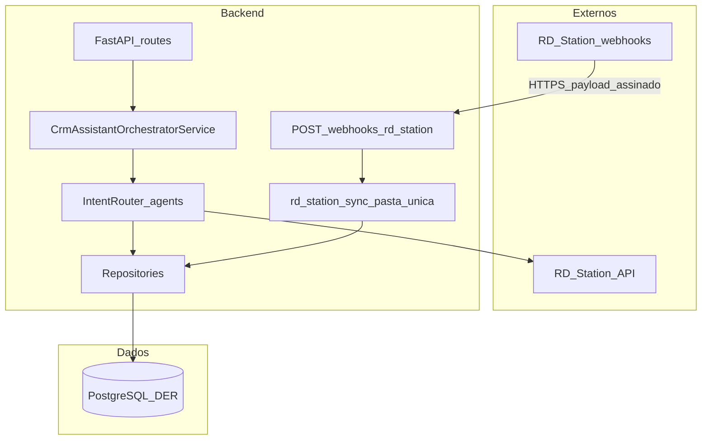

# Plano: backend TCC com organização APO-IA (PostgreSQL, RD Station, sem front imediato)

## Contexto

- **Referência de organização:** [README_apoia.md](c:\ObsidianVault\Sisloc\README_apoia.md) — FastAPI, serviços orquestradores, agentes, repositórios. **Não** replicamos o segundo braço do APO-IA: **sem** `AgenteSupportService`, **sem** integração **Doc360** nem fluxos paralelos de suporte sobre histórico de tickets de terceiros.
- **Negócio:** [contexto_projeto_tcc.md](c:\ObsidianVault\COTEMIG\TCC\contexto_projeto_tcc.md) — RD Station (OAuth 2.0), assistente NL, funil, perfis, DER com `usuario`, `leads`, `oportunidade`, `interacao`, `conversa_chatbot`, `mensagem`, `relatorio`, `sincronizacao`.

**SGBD:** **somente PostgreSQL** — o DER e toda a persistência da aplicação usam PostgreSQL (tipos, migrações e documentação do TCC devem ser alinhados a PG, sem menção a MySQL no planejamento de implementação).

**Front-end:** **fora do escopo deste plano imediato** — nenhuma pasta `frontend/` obrigatória neste repositório por ora; quando existir, pode ser **projeto ou ambiente separado**; a API expõe REST/OpenAPI para consumo futuro.

---

## Diagrama (backend + RD + PostgreSQL)

---

## Estrutura de pastas (espelho conceitual do APO-IA, simplificado)

Repositório [CRMAssistant](c:\Projetos\CRMAssistant): **apenas backend** neste ciclo (raiz `app/` ou `backend/app/` conforme preferência).

| Referência APO-IA | Equivalente neste projeto |
| --- | --- |
| `app/routes/chatbot.py` (sem `agente_support`) | `chat_crm.py`, `integracao_rd.py` (OAuth), `webhooks_rd.py`, `auth.py`, rotas de dados para kanban/relatórios quando necessário |
| `AgentsOrchestratorService` | **`CrmAssistantOrchestratorService` único** — toda assistência NL |
| `AgenteSupportService`, Doc360 | **Não implementar** |
| `core/agents/*` | Agentes CRM (intent router, resumo, funil, performance, conversacional, fora de escopo) — só orquestrador único |
| `core/retrievers/*` + `core/etl/*` | **Substituídos por uma única pasta**, por exemplo `app/core/rd_station_sync/`: recebe payloads/API RD, normaliza e grava no PostgreSQL (`leads`, `oportunidade`, log em `sincronizacao`). Pode organizar internamente em funções tipo extract/transform/load, **sem** subpastas paralelas “retriever” vs “etl”. |
| `domain/repositories/*`, `db/models.py` | Igual ideia APO-IA: repositórios + modelos SQLAlchemy do DER |
| `migrations/` | Alembic / SQL inicial **só** para tabelas relacionais do DER |

---

## Webhook RD Station (obrigatório no plano)

- **Endpoint dedicado**, por exemplo `POST /webhooks/rd-station` (ajustar path ao que a documentação oficial do RD Station CRM exigir para webhooks).
- **Padrões CRM / segurança:** validar **assinatura ou token secreto** configurado no painel RD; rejeitar corpo inválido com 4xx; responder rápido (ex.: 200/202) e processar persistência em **BackgroundTasks** ou fila leve, para não estourar timeout do RD em picos.
- **Idempotência:** usar IDs estáveis do RD (`lead_id`, `deal_id`/oportunidade) em `upsert` para evitar duplicatas em reentregas.
- **Escopo da sincronização neste endpoint:** **leads** e **oportunidades** (mapeamento dos campos do payload RD → colunas das tabelas `leads` e `oportunidade` + FKs/`usuario` quando aplicável); registrar cada execução em **`sincronizacao`** (status, payload resumido, erros).
- **Mesma lógica reutilizada:** o módulo da pasta única `rd_station_sync` é chamado pelo webhook e pode ser chamado por **sync manual** ou **jobs** após OAuth, evitando duplicação de código.

Documentação oficial RD Station para **formato do webhook, headers e verificação** deve ser seguida na implementação (não fixar aqui um JSON fictício).

---

## Subsistemas

1. **Assistente NL** — `POST /chat` (ou `/assistant/chat`): um orquestrador, IntentRouter, tools contra **PostgreSQL** (dados já sincronizados) e **API RD** quando precisar de dado em tempo real.
2. **Sincronização de dados** — webhook + pasta `rd_station_sync`; opcional scheduler como **fallback** (RNF de atraso aceitável).
3. **OAuth RD (RF02)** — authorize/callback, armazenamento e renovação de tokens.
4. **Auth app (RF01)** — JWT (ou sessão) para usuários; RF07 nos serviços/repos.

---

## Banco de dados

- PostgreSQL: tabelas do DER — `usuario`, `leads`, `oportunidade`, `interacao`, `conversa_chatbot`, `mensagem`, `relatorio`, `sincronizacao`.
- Escopo de dados: **somente** tabelas relacionais do DER e registros de sincronização; **sem** camada de busca semântica sobre corpus interno nesta entrega.

---

## Variáveis de ambiente (backend)

- `POSTGRES_URL` (asyncpg/SQLAlchemy async).
- OAuth RD: client id, secret, redirect URI; **segredo do webhook** (ou chave pública conforme doc RD).
- `ANTHROPIC_API_KEY` / `LLM_PROVIDER`, `JWT_SECRET`.
- `CORS_ORIGINS`: pode ficar restrito a localhost genérico ou vazio até existir front; quando o front for outro repo, configurar origem real.

---

## Fases (sem front)

1. Esqueleto FastAPI + Docker (Postgres + API) + DER em migrations.
2. `rd_station_sync`: módulos internos (parse, map, upsert) + testes com payloads de exemplo da doc RD.
3. **Webhook** `POST /webhooks/...` + persistência leads/oportunidades + `sincronizacao`.
4. OAuth RD + primeira carga complementar se necessário.
5. Auth JWT + endpoints de leitura agregada (kanban, etc.) conforme RF.
6. `CrmAssistantOrchestratorService` + agentes + `/chat`.
7. RNF: logging, OpenAPI, HTTPS em deploy, LGPD.

---

## Decisões para documentar no TCC

- Persistência e implementação **exclusivamente em PostgreSQL** (alinhamento técnico ao stack de referência e ao deploy único).
- **Sem** segunda linha de produto “suporte/KB”; **sem** Doc360.
- **Ingestão RD** centralizada em **uma pasta**; **webhook** como canal principal de atualização de leads e oportunidades.
- **Interface:** consumidores futuros (web mobile, outro repositório) via API; escopo de front **adiado**.

---

## Fora de escopo

- Front-end (TypeScript/Figma) neste momento — decisão de mono vs multi repo fica em aberto.
- `AgenteSupportService`, `/agente`, Doc360, fluxos de suporte sobre tickets de sistemas externos.
- n8n como obrigatório (RD pode apontar webhook direto para esta API).
